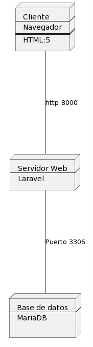

# Diseño Arquitectónico

## Arquitectura del proyecto
El proyecto estará basado en Laravel, cuya arquitectura sigue el patrón de diseño MVC (Modelo-Vista-Controlador). Este enfoque estructural facilita la organización y mantenimiento del código, promoviendo la separación de preocupaciones entre la lógica de negocio, la presentación de datos y la interfaz de usuario entre los colaboradores.

    Modelo: Representa los datos y la lógica de negocio de la aplicación. Esto permite definir y manipular los datos de manera intuitiva y eficiente.

    Vista: Se encarga de mostrar la información al usuario final. En Laravel, las vistas son archivos de blade que combinan HTML con expresiones de PHP, lo que facilita la creación de interfaces de usuario dinámicas y reutilizables.

    Controlador: Actúa como intermediario entre el modelo y la vista, gestionando las solicitudes HTTP y coordinando la lógica de la aplicación. Los controladores en Laravel son clases PHP que encapsulan la lógica de manejo de peticiones y devuelven respuestas adecuadas.

Esta arquitectura fomenta la modularidad y la escalabilidad del proyecto, permitiendo a los desarrolladores trabajar de manera colaborativa y eficiente en diferentes partes de la aplicación. Además, Laravel ofrece herramientas y convenciones que simplifican el desarrollo y mantenimiento de aplicaciones web robustas y de alto rendimiento.

## Diseño de los datos

### Modelo Relacional:

## Diseño de componentes

### Diagrama de componentes

El proyecto estará compuesto por un servidor Bitnami con Laravel conectado con MariaDB(ambos docketizados), el servicio de Laravel se encargará de crear el framework para el proyecto, y actuará como intérprete y servidor web, este estará conectado a MariaDB, donde guardaremos los datos.

[Volver](../Diseño.md)